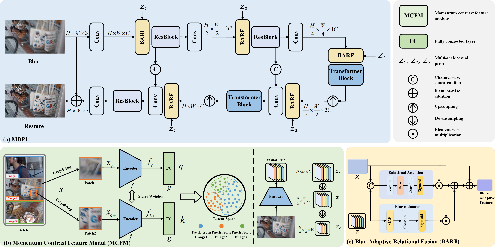

# MDPL: Multi-Scale Degradation-Aware Prior Learning for Image Deblurring via Momentum Contrast  and Blur-Adaptive Relational Fusion


<hr />

> **Abstract:** *Image deblurring remains challenging due to complex and diverse blur patterns caused by camera shake and object motion. Existing methods often focus on network architecture optimization, overlooking explicit modeling of image-level degradation, which limits their applicability to diverse scenarios. Inspired by the observation that different images are degraded in dissimilar ways, we propose MDPL, a novel framework that learns multi-scale degradation-aware priors for image deblurring. The framework incorporates a Momentum Contrast Feature Module (MCFM) using momentum contrast learning to model image-level degradation-aware knowledge as visual priors. These priors are embedded into a Transformer-enhanced architecture’s hierarchical features via a lightweight Blur-Adaptive Relational Fusion (BARF) module, which employs relational attention and blur strength estimation to capture dynamic interactions and adapt to blur severity. Benefiting from the modeling of rich degradation knowledge, MDPL effectively enhances deblurring performance on complex and diverse blurry images. Extensive experiments on three widely-adopted datasets, including GoPro, HIDE, and RealBlur, confirm that our MDPL achieves state-of-the-art performance (\textit{e.g.}, 33.82 dB in PSNR on GoPro dataset).* 
<hr />

## Installation
```
cd DeAP
conda create -n DeAP python=3.9.19
source activate DeAP
conda install pytorch==1.13.0 torchvision==0.14.0 torchaudio==0.13.0 cudatoolkit=11.7 -c pytorch -c conda-forge
pip install opencv-python tqdm glog scikit-image albumentations
pip install -U albumentations[imgaug]
pip install albumentations==1.1.0
```
## Network Architecture


## Training and Testing
### 1. Data Preparation
Download "[GoPro](https://drive.google.com/drive/folders/1bEZO-l6sI9NXMRd98ldi74kCGAnw4bLQ)" dataset into './datasets' </br>
For example: './datasets/GoPro'
### 2. Training
* The training script uses 8 GPUs by default.
* Run the following command
```
sh run.sh
```
### 3. Testing
**For testing on GoPro/HIDE dataset** </br>
* You should modify the image path in train_config.py. </br>
* Run the following command
```
python tools/predict_GoPro.py
```
**For testing on RealBlur-J/RealBlur-R dataset** </br>
* You should modify the image path in train_config.py. </br>
* Run the following command
```
python tools/predict_RealBlur.py
```
## Evaluation
Before you evaluate, you should download the results into './out'.
* For evaluation on GoPro/HIDE results in MATLAB, Run the following command
```
evaluation_GoPro.m
```
* For evaluation on RealBlur results, Run the following command
```
python evaluate_RealBlur.py
```
## Acknowledgment
This repo is build upon [Stripformer](https://github.com/pp00704831/Stripformer-ECCV-2022-). We acknowledg these excellent implementations.